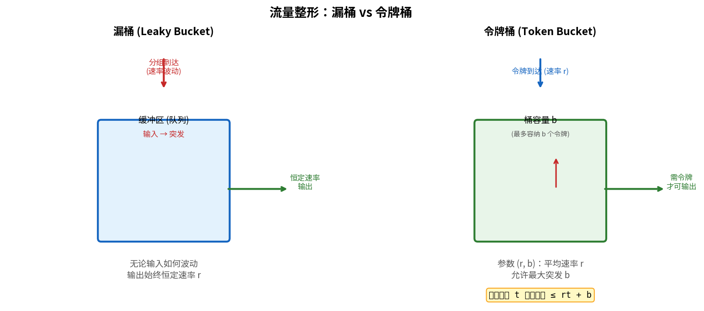
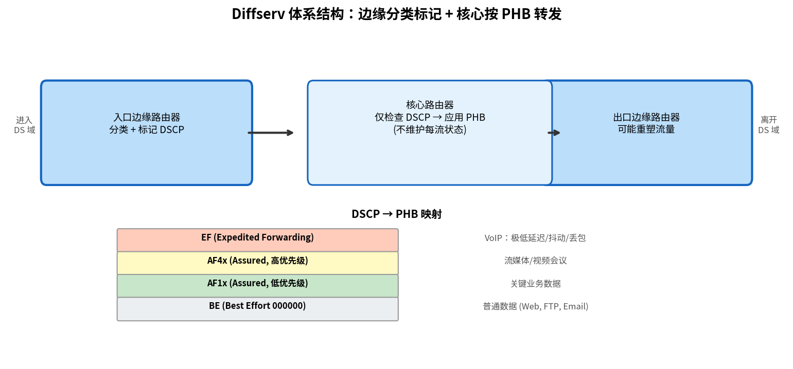

# 服务质量

> 参考：Kurose §9.5

**服务质量（Quality of Service, QoS）**是指网络为不同应用提供不同等级性能保证的能力。因特网的尽力而为模型不能满足所有应用——会话式 VoIP 需要低延迟保证，流媒体需要稳定带宽。QoS 机制在尽力而为的基础上提供**差异化服务**。

## 尽力而为网络的维度化（Dimensioning）

一种观点认为，无需复杂的 QoS 机制——只需确保网络核心有**充足的带宽**即可。如果每条链路的容量始终超过需求峰值，排队时延和丢包自然接近于零。这种"过度供给（over-provisioning）"的方法简单有效，但是：

- 流量需求增长可能快于链路升级
- 波动的流量峰值（如热点事件直播）仍然可能造成拥塞
- 链路的成本并非零——过度供给在全网范围内可能不经济

因此需要更精细的 QoS 机制。

## 服务等级划分

### 三种服务等级

| 等级 | 描述 | 适用场景 | 机制 |
|------|------|---------|------|
| **尽力而为（Best-Effort）** | 无任何保证 | 普通数据（Web、FTP、电子邮件） | FIFO 队列 |
| **区分服务（Differentiated, Diffserv）** | 流量的**相对优先级**——某些类比其他类获得更好的处理 | VoIP、流媒体 vs 普通数据 | 多队列+调度 |
| **每流保证（Per-Flow Guarantees, IntServ）** | 每个流的**绝对性能保证**（带宽、延迟） | 严格的实时应用 | RSVP+准入控制 |

## 流量整形与监管（Traffic Shaping & Policing）

QoS 实现的前提是能够控制和测量流量的特性。

### 漏桶（Leaky Bucket）

漏桶以**恒定速率**输出分组。无论输入速率如何波动，输出速率始终恒定。漏桶的参数为**输出速率 $r$** 和**桶容量 $b$**（最大缓冲的分组数）。

- 如果输入速率长期超过 $r$，漏桶（缓冲区）溢出，多余分组被丢弃
- 漏桶**平滑**了突发流量，但可能引入额外时延（分组在桶中等待输出）

### 令牌桶（Token Bucket）

令牌桶更灵活——允许短期突发，同时限制长期平均速率：

- 令牌以**恒定速率 $r$** 加入桶中，桶最多容纳 $b$ 个令牌
- 发送一个分组需消耗一个令牌；若无足够令牌，分组被缓冲或丢弃
- 参数 **$(r, b)$** 定义：$r$ 是长期平均速率限制，$b$ 是允许的最大突发量

在任意时间间隔 $t$ 内，能发送的分组总量不超过 $rt + b$。

## 分组调度（Packet Scheduling）

QoS 路由器输出端口使用调度算法在多队列之间分配带宽。

### 优先级排队（Priority Queuing, PQ）

每个分组被分类并分配到不同的**优先级队列**。高优先级队列先于低优先级队列被服务：

- 只要高优先级队列非空，就一直服务高优先级队列
- 低优先级分组可能**饿死**——高优先级流量饱和时永远得不到服务

### 加权公平排队（Weighted Fair Queuing, WFQ）

每个队列分配一个权重 $w_i$，保证该队列获得链路带宽的比例为 $w_i / \sum w_j$：

- 不同队列**隔离**——一个队列的突发不影响其他队列的保证带宽
- 未使用的带宽可按比例重新分配给活跃队列
- 每个队列模仿一个**独立的 GPS（Generalized Processor Sharing）**调度器

WFQ 在 Diffserv 中是实现服务区分的关键机制。

## Diffserv（区分服务）

Diffserv 是 IETF 定义的可扩展 QoS 框架（RFC 2475），适用于大型 IP 网络。核心思想：

1. **在边缘分类和标记**：边界路由器根据 5 元组（或应用层信息）将分组分配到不同的**行为聚合（Behavior Aggregate）**，并在 IP 首部的 **DSCP（Diffserv Code Point）**字段中标记（6 比特，替代 TOS 字段）
2. **在核心按标记处理**：核心路由器仅根据分组的 DSCP 字段应用对应的**每跳行为（PHB, Per-Hop Behavior）**，不需要维护每流状态——这使 Diffserv 具有良好的**可扩展性**

### 两种典型 PHB

| PHB | 全称 | 含义 | 典型应用 |
|-----|------|------|---------|
| **EF（Expedited Forwarding）** | 快速转发 | 保证离开速率 ≥ 配置速率，且极低延迟/抖动/丢包（模拟专线行为） | VoIP |
| **AF（Assured Forwarding）** | 确保转发 | 4 类 × 3 种丢弃优先级 = 12 种 AF PHB。拥塞时低丢弃优先级的分组优先保留 | 流媒体、关键业务数据 |

AF 类的分组在拥塞发生前被正常转发；拥塞时，高丢弃优先级的分组被首先丢弃（通过 WRED 等主动队列管理）。

## IntServ 与 RSVP（简要）

IntServ（Integrated Services）提供**每流**的绝对 QoS 保证。通过 **RSVP（Resource Reservation Protocol）**在每流的路由路径上预留资源。

IntServ 的局限：
- 需要在所有路由器上维护每流状态（流数量巨大时不可扩展）
- RSVP 信令开销随流数量线性增长
- 未被核心 Internet 大规模部署，主要用于企业或专用网络

## 实际因特网的 QoS 现状

当前因特网主要依赖：
- **过度供给**：核心链路带宽充沛，拥塞主要在接入网边缘
- **Diffserv EF/AF**：少数企业和服务提供商部署
- **应用层自适应**：DASH、自适应 VoIP 编解码器等由端系统自行应对网络波动

- [[路由器排队与调度]]
- [[IP语音]]
- [[流式存储视频]]
- [[多媒体网络应用概述]]
- [[去抖动缓冲区]]
- [[网络层概述]]
- [[网络层控制平面概述]]
