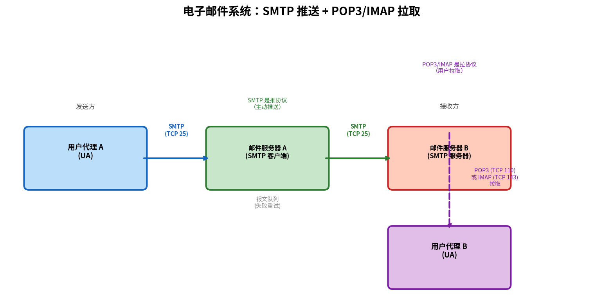

# 电子邮件与 SMTP

> 参考：Kurose §2.3.1–§2.3.3

因特网电子邮件系统由三个主要组件构成：**用户代理（user agent）**、**邮件服务器（mail server）**和**简单邮件传输协议（SMTP）**。

## 因特网邮件系统结构



### 用户代理

用户代理（User Agent, UA）是用户与电子邮件系统的接口——通常是一个应用程序（如 Outlook、Thunderbird、Apple Mail）或 Web 邮件界面（如 Gmail 的网页界面）。用户代理允许用户撰写、阅读、回复、转发、保存和整理邮件。

### 邮件服务器

邮件服务器是电子邮件体系结构的核心。每个接收方在某个邮件服务器上拥有一个**邮箱（mailbox）**，管理着为该用户收到的报文。邮件服务器还维护一个**报文队列（message queue）**，包含待发送的邮件报文。发送方的邮件服务器定期尝试将队列中的邮件交付到接收方的邮件服务器——如果无法交付（接收方服务器宕机），邮件会在发送方服务器的队列中等待并在之后重试（通常每 30 分钟左右重试一次，持续数天）。

### SMTP

SMTP 是因特网电子邮件系统中的**应用层协议**，用于将邮件从发送方邮件服务器传输到接收方邮件服务器。SMTP 使用 TCP 端口 **25**。

SMTP 有两个重要特点：

- SMTP 是一个**推协议（push protocol）**——发送方邮件服务器主动将邮件推送到接收方邮件服务器。这与 HTTP 的拉取模式不同。
- SMTP 要求报文（首部和主体）使用 **7 比特 ASCII 编码**。多媒体数据需要编码为 ASCII 后再传输。

## SMTP 交互示例

以下是一个典型的 SMTP 会话（客户 C 发送邮件给服务器 S），采用了简单的命令-响应模式：

```
S: 220 hamburger.edu
C: HELO crepes.fr
S: 250 Hello crepes.fr, pleased to meet you
C: MAIL FROM: <alice@crepes.fr>
S: 250 alice@crepes.fr ... Sender ok
C: RCPT TO: <bob@hamburger.edu>
S: 250 bob@hamburger.edu ... Recipient ok
C: DATA
S: 354 Enter mail, end with "." on a line by itself
C: Do you like ketchup?
C: How about pickles?
C: .
S: 250 Message accepted for delivery
C: QUIT
S: 221 hamburger.edu closing connection
```

客户端发送了五个命令：HELO（标识自己）、MAIL FROM（标识发送方）、RCPT TO（标识接收方）、DATA（开始传输邮件内容）和 QUIT（结束会话）。每个命令后服务器返回一个响应码和说明文字。

SMTP 使用的是一种**持久的 TCP 连接**——如果发送方有多个邮件要发送到同一个接收方邮件服务器，它可以复用同一个 TCP 连接发送所有邮件。

## SMTP 与 HTTP 的对比

| | SMTP | HTTP |
|---|------|------|
| **数据传输方式** | 推（push）——发送方主动推送 | 拉（pull）——客户端向服务器拉取 |
| **编码** | 所有报文和数据须为 7 比特 ASCII；二进制数据用 MIME 编码 | 不需要二进制数据编码，Content-Type 头可指定任意 MIME 类型 |
| **多对象封装** | 所有报文对象（文本 + 附件）封装在**一个报文中** | 每个对象在独立的请求/响应报文中传输 |
| **状态码** | SMTP 使用三位数字代码 + 说明文字 | HTTP 使用三位数字代码 + 原因短语 |
| **持久性** | 持久 TCP 连接（多邮件复用） | HTTP/1.0 非持久；HTTP/1.1 默认持久（[[HTTP持久连接与非持久连接|详见]]） |

一个微妙的区别：HTTP 主要是**拉协议**——用户从 Web 服务器拉取信息，TCP 连接由想要接收数据的机器发起。SMTP 是**推协议**——发送邮件服务器将文件推向接收邮件服务器，TCP 连接由想要发送文件的机器发起。

## 邮件报文格式与 MIME

### 报文格式

邮件报文由**首部（header）**和**主体（body）**组成，两者之间由一个空行（CRLF）分隔。每个首部行包含关键词后跟冒号和值：

```
From: alice@crepes.fr
To: bob@hamburger.edu
Subject: Searching for the meaning of life.

（空行——此后为报文主体）
```

首部必须包含 `From:` 和 `To:` 行，可选包含 `Subject:` 和 `Cc:` 等行。

### MIME（多用途因特网邮件扩展）

SMTP 最初设计只能传输 7 比特 ASCII 编码的文本。**MIME（Multipurpose Internet Mail Extensions）**通过额外的首部行扩展了邮件报文格式，使其可以支持非 ASCII 文本和非文本附件（图像、音频、视频、应用程序文件等）。

MIME 新增的首部行包括：

```
From: alice@crepes.fr
To: bob@hamburger.edu
Subject: Picture of yummy crepe.
MIME-Version: 1.0
Content-Transfer-Encoding: base64
Content-Type: image/jpeg

(base64 encoded data ...)
```

- **MIME-Version**：指示 MIME 版本
- **Content-Transfer-Encoding**：指示主体中数据的编码方式（如 base64），使二进制数据可转换为 ASCII 以便通过 SMTP 传输
- **Content-Type**：指示主体中数据的 MIME 类型，使接收方邮件阅读器能正确解码和显示（如 `image/jpeg`、`audio/basic`、`application/msword`）

接收方用户代理使用 Content-Type 头来确定如何处理报文主体——例如调用图像查看器显示 JPEG，或调用音频播放器播放音频。报文还可使用 `multipart/mixed` 类型在单个报文中包含多个不同类型的内容块（文本 + 附件）。

- [[MIME]]
- [[POP3与IMAP]]
- [[应用层协议原理]]
- [[HTTP]]
- [[HTTP持久连接与非持久连接]]
- [[Socket编程]]
- [[安全电子邮件]]
