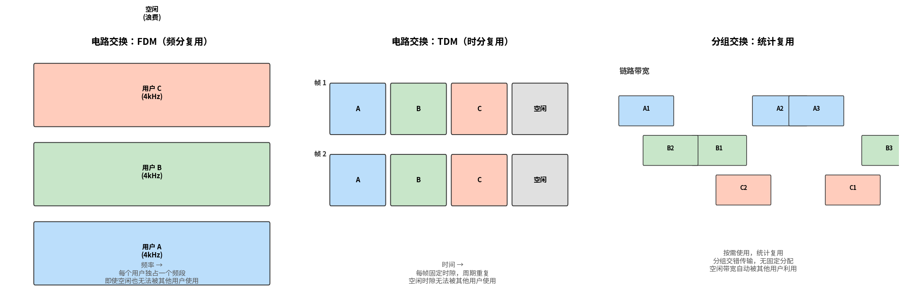

# 电路交换

> 参考：Kurose §1.3.2

电路交换（circuit switching）是传统电话网络使用的数据传输方式。在电路交换网络中，端系统之间通信前，必须先在路径上的每个交换机中**建立一条端到端的专用电路（连接）**。这条电路上的资源（链路带宽、缓冲区）在通信期间为这两个端系统**独占**——即使没有数据传输，资源也不会被其他通信使用。

## 电路建立过程

电路交换的通信经历三个阶段：

1. **电路建立（Circuit Establishment）**：在源和目的地之间的路径上预留资源。沿途每个交换机为这个连接分配特定资源（频段或时隙）。
2. **数据传输（Data Transfer）**：通过已建立的专用电路持续传输数据，获得恒定速率的服务保障。
3. **电路拆除（Circuit Teardown）**：通信结束后释放资源，使其可被其他连接使用。

电路建立需要一定时间（往返信令交互），数据传输阶段的数据不需要分组首部中的地址信息——因为路径已经确定，交换机知道应如何转发每个时隙或频段的数据。

## 复用方式

链路中的传输资源通过以下两种方式在多个电路（连接）之间共享：

### 频分复用（FDM）

**频分复用（Frequency-Division Multiplexing, FDM）**将链路的频谱划分为多个频段（frequency band）。在连接建立期间，网络为每个连接分配一个特定频段。在模拟电话网络中，每个频段通常为 4 kHz。在连接期间，连接专属地使用该频段——其他连接的数据不会出现在该频段中。即使该连接没有任何数据传输，该频段仍然保持空闲（不被其他连接使用）。

FDM 已在 1.2.1 节介绍的 DSL 接入技术中使用：DSL 链路将频谱划分为 0–4 kHz 的电话信道、4–50 kHz 的上行数据信道和 50 kHz–1 MHz 的下行数据信道。

### 时分复用（TDM）

**时分复用（Time-Division Multiplexing, TDM）**将时间划分为固定长度的**帧（frame）**，每帧再划分为固定数量的**时隙（time slot）**。在连接建立期间，网络为每个连接分配一个特定的时隙号。在每个帧的相应时隙中，该连接可以传输一个固定长度的数据单元。时隙在每帧中周期性地出现，传输速率 = 帧速率 × 时隙中的比特数。

以 **T1 线路**（北美数字电话标准）为例，来展示 TDM 时隙带宽的计算过程：

PCM 语音数字化中的采样率是 **8000 次/秒**（奈奎斯特定理要求采样率 ≥ 信号最高频率的 2 倍，电话语音限于 4 kHz，$2 \times 4000 = 8000$）。因此每 1/8000 = **125 μs** 采样一次，每个样本 8 比特。

T1 线路将 24 路数字化语音按 TDM 方式复用：

| 参数 | 值 | 含义 |
|------|-----|------|
| 帧周期 | 125 μs | 每帧固定间隔 |
| 帧速率 | 8000 帧/秒 | 1 / 125 μs |
| 每帧时隙数 | 24 | 每帧 24 个时隙，各承载一路语音 |
| 每时隙比特数 | 8 bit | PCM 每次采样 8 比特 |
| 成帧比特 | 1 bit/帧 | 每帧末尾额外 1 比特用于同步（标识帧边界） |

**每路语音的带宽**：

$$\text{时隙速率} = 8 \text{ bit/时隙} \times 8000 \text{ 帧/秒} = 64 \text{ kbps}$$

这就是 **DS0（Digital Signal 0）**，数字电话系统的最小传输单元。

**T1 总带宽**：

$$\text{T1 速率} = (24 \times 8 + 1) \times 8000 = 193 \times 8000 = 1.544 \text{ Mbps}$$

关键点：无论连接是否有数据需要发送，其时隙仍属于该连接——未被使用的时隙被浪费（保持空闲）。

## 电路交换的问题

电路交换的主要缺点在于**资源利用效率低**。考虑一个以 TDM 方式共享链路的例子：分配给某个连接的一个时隙即使在该连接完全静默（无数据传输）时也无法被其他连接使用。对于因特网中典型的突发性数据流量（用户大部分时间在阅读网页而非持续下载），这种预留方式造成了严重的资源浪费。

## 分组交换与电路交换的对比

| | 分组交换 | 电路交换 |
|---|---------|---------|
| **资源分配** | 按需统计复用 | 预先预留、独占 |
| **静默时的资源** | 可被其他用户使用 | 浪费（保持空闲） |
| **建立时间** | 无需建立 | 需要 RTT 级别的信令往返 |
| **服务质量** | 尽力而为（可能排队、丢包） | 有保障（恒定速率、无排队） |
| **状态维护** | 无连接状态（每个分组独立路由） | 每跳维护每条电路的状态 |
| **典型应用** | 因特网数据 | 传统电话、ISDN |

### 分组交换优于电路交换的量化示例

考虑一个 1 Mbps 链路被多个用户共享的情景。每个用户在活动时以恒定速率 100 kbps 生成数据，但只在 10% 的时间活动（其他 90% 时间静默）。

- **电路交换（TDM）**：最多支持 $\frac{1\text{ Mbps}}{100\text{ kbps}} = 10$ 个同时用户。如果有 35 个用户，只能 10 人同时通信。当某用户的时隙未被使用时，该时隙空闲。
- **分组交换**：35 个用户中同时有 10 个以上活跃的概率小于 0.0004（即阻塞概率极低）。分组交换的用户总数远大于电路交换能支持的用户数，因为分组交换利用了用户活动的统计特性——所有用户不太可能同时活跃。在多数时候只有少数活跃用户时，这些用户可以自由使用整个 1 Mbps 带宽。偶尔超过 10 个用户同时活跃的情况仅导致少量排队。

当前趋势明显朝向分组交换——甚至许多传统的电路交换电话网络也正在逐渐迁移到分组交换（特别是昂贵的越洋电话部分）。

- [[网络核心]]
- [[分组交换]]
- [[时延丢包与吞吐量]]
- [[计算机网络历史]]
- [[接入网]]
- [[网络的网络]]
