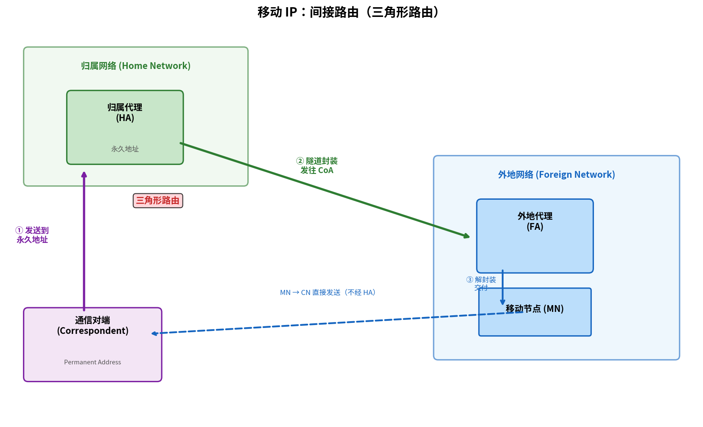

# 移动性管理原理

> 参考：Kurose §7.5

移动性管理要回答的问题是：当一台主机从一个网络移动到另一个网络时，如何维持正在进行的通信？传统 IP 地址既作为**位置标识**（告诉我你在哪里以便我能路由到你），又作为**身份标识**（告诉我是谁）——两者绑定在一起。当主机移动时，它的位置变了，但身份应该保持不变。解决这一矛盾是移动性管理的核心。

## 移动性的基本要素

考虑一个类比：你从旧金山搬到了纽约。发往你旧金山地址的信件无法自动送达纽约的新住处。邮政服务需要：

- **邮件转发服务**：旧金山邮局收到你旧地址的邮件后，将其重封装并发送到纽约新地址
- **地址通知**：你必须提前告知旧金山邮局你的新地址

在因特网中，设备的**固定地址**类似旧金山地址，一旦移动就无法直接路由到它。移动性管理使用了类似邮件转发的方案。

## 术语与实体

移动 IP（Mobile IP, RFC 5944 / RFC 6275）定义了以下关键实体：

| 实体 | 角色 |
|------|------|
| **归属网络（Home Network）** | 移动节点"永久居住"的网络 |
| **归属代理（Home Agent, HA）** | 归属网络中的路由器，负责截获发往移动节点的数据报并转发到其当前位置 |
| **外地网络（Foreign / Visited Network）** | 移动节点当前所在的网络 |
| **外地代理（Foreign Agent, FA）** | 外地网络中的路由器，向移动节点提供本地路由服务（在 IPv6 移动 IP 中，FA 的功能由节点自身执行） |
| **转交地址（Care-of Address, CoA）** | 移动节点在外地网络中的临时地址——归属代理将数据报重封装后发往此地址 |
| **通信对端（Correspondent）** | 与移动节点通信的远程对等方 |

## 间接路由（Indirect Routing）

间接路由是移动 IP 的基本转发方式。发往移动节点的数据报**始终先到达归属代理**，再由归属代理转发到当前位置。

### 具体步骤

1. **代理发现（Agent Discovery）**：移动节点到达外地网络时，收到外地代理周期性广播的**代理通告（Agent Advertisement）**——包含外地代理的 IP 地址、可用的转交地址等信息。移动节点也可主动发送**代理请求（Agent Solicitation）**
2. **注册（Registration）**：移动节点通过外地代理向归属代理发送注册消息，告知其当前的转交地址（CoA）。归属代理验证并确认注册
3. **数据转发**：通信对端向移动节点的**永久地址**（归属网络地址）发送数据报。归属代理截获（使用代理 [[链路层寻址与ARP|ARP]]）该数据报，用一个新的 IP 首部封装——源 IP = HA，目的 IP = CoA——形成隧道
4. **解封装**：外地代理收到隧道包，剥离外层 IP 首部，将原始数据报交付给移动节点

从移动节点发出的数据报直接使用标准 IP 路由（源 IP = 移动节点永久地址），无需通过归属代理。

### 三角形路由（Triangle Routing）

间接路由的明显问题是**三角形路由**——通信对端 → 归属代理 → 外地代理，比直接到移动节点多了一程。尤其当通信对端与移动节点很近但归属代理很远时（如两人在同一个外国，但归属代理远在太平洋彼岸），这种绕路非常浪费。

## 直接路由（Direct Routing）

直接路由解决了三角形路由问题。通信对端在与移动节点通信前，先从归属代理**获知 CoA**，之后的通信直接发送到 CoA，不再经过归属代理。

然而直接路由引入了新的挑战：**移动节点的位置变化时需要通知所有通信对端更新 CoA**。对于 TCP 连接，还需要维护连接在 IP 地址变化后不中断。

## 移动 IPv6

IPv6 在设计时就考虑了移动性。与 IPv4 移动 IP 的主要差异：

- **无外地代理**：移动节点在新的网络中通过标准 IPv6 机制（DHCPv6 或无状态自动配置）获得 CoA，自行注册
- **路由优化内建**：移动节点直接向通信对端注册 CoA，避免三角形路由
- **认证**：使用 IPsec 进行代理和注册消息的认证

## 蜂窝网络的移动性管理

与移动 IP 的通用框架不同，蜂窝网络的移动性管理高度集成在体系结构中。在 LTE 中：

- **归属网络 = HSS 中的用户归属记录**，移动性通过 S-GW 和 MME 完成
- UE 在不同 eNodeB 间移动时由 MME 协调切换（参见 [[蜂窝网络因特网接入]]），没有"代理发现/注册"等独立过程
- 层次化切换：同一 MME 内的切换较简单（X2 接口），不同 MME 间的切换需要与 HSS 交互

- [[蜂窝网络因特网接入]]
- [[无线网络概述]]
- [[无线与移动性对TCP的影响]]
- [[IPv4编址]]
- [[IPv6]]
- [[802.11帧]]
