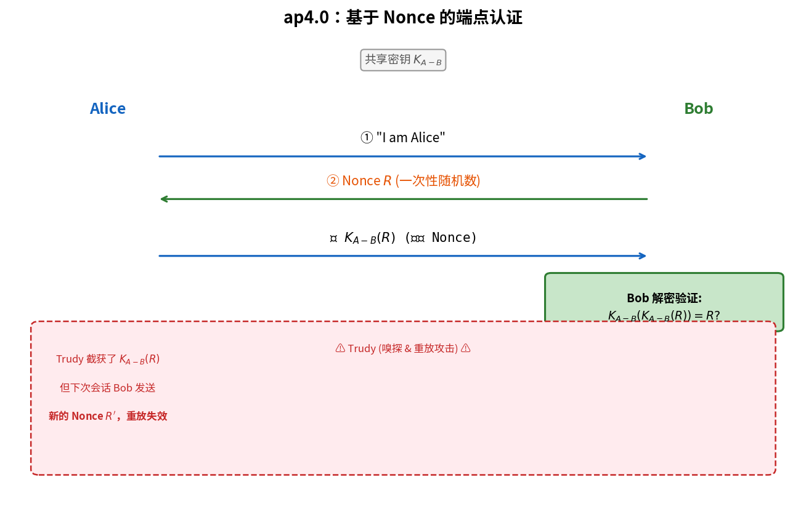

# 端点认证

> 参考：Kurose §8.4

**端点认证（End-Point Authentication）**是指通信一方验证另一方身份的过程。在面对面的人类交流中，视觉识别天然解决了认证问题；但在网络中，通信双方无法直接确认对方身份，攻击者可以冒充合法用户。

## 认证协议的逐步演进

Kurose 使用四个版本的认证协议（ap1.0–ap4.0）展示了从不安全到安全的设计过程，每个版本都针对前一版本的漏洞进行改进。

### ap1.0：无认证

Alice 直接发送消息 `"I am Alice"` 给 Bob。Trudy 也可以发送相同的消息，Bob 无法区分。**没有提供任何认证**。

### ap2.0：基于 IP 地址

Alice 发送 `"I am Alice"`，Bob 检查分组的源 IP 地址是否为 Alice 的已知 IP 地址。

**漏洞**：Trudy 可以通过 **IP 欺骗（IP Spoofing）**伪造源 IP 地址，构造一个看似来自 Alice 的分组。Bob 无法通过 IP 地址可靠地认证通信方。

### ap3.0：基于共享秘密口令

Alice 和 Bob 预先共享一个秘密口令。Alice 发送消息和口令：`"I am Alice" + password`。

**漏洞**：Trudy 通过**分组嗅探**截获 Alice 的通信，获取明文口令。之后 Trudy **重放（replay）**截获的消息（包括口令），即可冒充 Alice。这就是**重放攻击（Replay Attack）**。

### ap3.1：加密口令

Alice 和 Bob 共享一个对称密钥 $K_{A-B}$。Alice 发送加密的口令：`"I am Alice" + K_{A-B}(password)`。

**漏洞**：这仍然无法防御重放攻击。Trudy 嗅探到加密的口令后，可以直接回放它——Trudy 不需要解密，只需原样重放即可冒充 Alice。

### ap4.0：使用 Nonce

ap4.0 引入了**一次性随机数（nonce）**来防御重放攻击：

1. Alice 发送 `"I am Alice"` 给 Bob
2. Bob 生成一个**一次性随机数 $R$（nonce）**，发送给 Alice
3. Alice 用共享密钥 $K_{A-B}$ 加密 $R$，发送 $K_{A-B}(R)$ 给 Bob
4. Bob 解密收到的消息，检查是否等于自己发出的 $R$

**为什么能防重放**：每个会话中 Bob 选择不同的 nonce。Trudy 截获了上一个会话的 $K_{A-B}(R)$ 也无法用于新会话——新 nonce 不同，回放旧加密值会被识破。

**举例**：即使 Trudy 被 Bob 怀疑有外遇并成功确定了 l, o, v, e 的加密替换（如单表密码例子），在 ap4.0 中，Bob 每次用不同的随机数挑战 Alice，Trudy 无法用之前的有效加密值来响应新的挑战。

## Nonce 的两种实现

| 类型 | 说明 | 安全性 |
|------|------|--------|
| **真正的随机数** | 每次随机生成，不重复 | 最安全，TLS 使用 |
| **时间戳** | 使用当前时间，要求时钟同步 | 须确保时间窗口内不重放 |

## 对称密钥认证 vs 公钥认证

### 对称密钥方式

ap4.0 使用共享密钥 $K_{A-B}$。核心步骤：Bob 发 nonce $R$，Alice 回复 $K_{A-B}(R)$。需要双方预先共享密钥，存在密钥分发问题。

### 公钥方式（TLS 中使用）

1. Bob 发送 nonce $R$ 给 Alice
2. Alice 用自己的**私钥** $K_A^-$ 签名 $R$，发回 $K_A^-(R)$
3. Bob 用 Alice 的**公钥** $K_A^+$ 验证签名：$K_A^+(K_A^-(R)) \stackrel{?}{=} R$

Bob 无需知道 Alice 的任何秘密，只需可信地获取 Alice 的公钥（通过 PKI/证书）。

## 中间人攻击（Man-in-the-Middle Attack）

即使有完善的认证协议，**中间人攻击**仍是重大威胁：

1. Trudy 位于 Alice 和 Bob 的通信路径中间（例如通过 ARP 欺骗接管 IP 地址）
2. Alice 向 Bob 发起连接时，实际上是 Trudy 在响应——Trudy 向 Alice 假扮 Bob，同时向 Bob 假扮 Alice
3. Trudy 在两个方向上分别建立加密信道，可以解密、查看、修改所有"加密"通信

**防御**：端点认证必须绑定到可验证的**身份**（如域名证书）。TLS 通过 **CA 签发的证书**将公钥绑定到特定的 DNS 域名，Alice 的浏览器验证证书中的域名与自己访问的 URL 匹配即可发现中间人。

- [[公开密钥密码学]]
- [[对称密钥密码学]]
- [[数字签名]]
- [[TLS]]
- [[消息认证码]]
- [[安全电子邮件]]
- [[IPsec与VPN]]
- [[计算机网络安全概述]]
