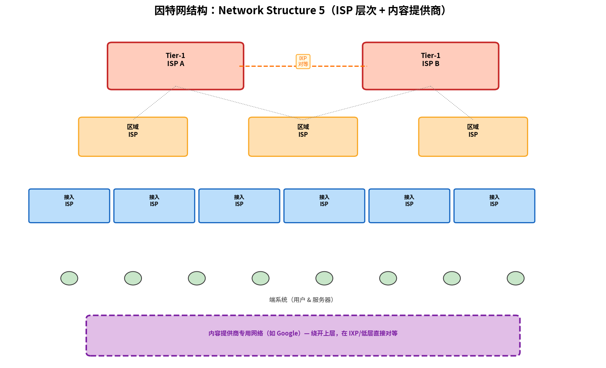

# 网络的网络

> 参考：Kurose §1.3.3

因特网不是单一的网络，而是由成千上万个 ISP 网络互相连接形成的**网络之网络（network of networks）**。端系统通过接入 ISP 连接到因特网——但这只是解决连接数十亿端系统这一拼图中的一小块。要完成拼图，接入 ISP 自身必须互联。理解"网络的网络"是理解因特网的关键。

因特网的结构在很大程度上由**经济和国家政策**驱动，而非纯粹的性能考量。为了理解这一复杂的层级结构，Kurose 通过逐步构建一系列网络结构（从 Network Structure 1 到 Network Structure 5）来近似现实中的因特网。

## Network Structure 1：单一全球转接 ISP

最简单的方案：所有接入 ISP 通过一个**全球转接 ISP（Global Transit ISP）**互联。这个想象的全球 ISP 拥有遍布全球的路由器和通信链路网络，在每个接入 ISP 附近至少有一个路由器。接入 ISP 向全球 ISP 支付连接费用——接入 ISP 是**客户（customer）**，全球 ISP 是**提供商（provider）**。

## Network Structure 2：多个全球转接 ISP

如果有公司运营了盈利的全球转接 ISP，自然会有其他公司进入市场竞争。于是 Network Structure 2 由成千上万个接入 ISP 和**多个**全球转接 ISP 组成。接入 ISP 可以根据定价和服务在竞争的全球提供商之间选择。但全球转接 ISP 自身也必须互联——否则连接到不同全球提供商的接入 ISP 之间将无法通信。

这是一个**二层层次结构**：全球转接 ISP 在上层，接入 ISP 在底层。

## Network Structure 3：层次 ISP

现实中，没有一个 ISP 能覆盖世界的每一个城市。在任何给定区域，可能存在一个**区域 ISP（regional ISP）**，该区域的接入 ISP 连接到它。区域 ISP 再连接到**第一层 ISP（Tier-1 ISP）**。Tier-1 ISP 类似于全球转接 ISP，但并不在每个城市都存在。全球约有十几家 Tier-1 ISP，包括 Level 3 Communications、AT&T、Sprint 和 NTT。

有趣的是，没有任何官方组织认定 Tier-1 身份——正如俗话所说："如果你还须要问自己是否是某个群体的成员，你可能就不是。"

在这个多层层次结构中（此时代理已变得仅是对今天因特网的粗略近似），每个接入 ISP 向其连接的区域 ISP 付费，每个区域 ISP 向其连接的 Tier-1 ISP 付费。也存在更大的区域 ISP 跨足整个国家，较小的区域 ISP 再连接到它（如在中国，每个城市有接入 ISP，连接到省级 ISP，再连接到国家级 ISP，最后连接到 Tier-1 ISP）。

## Network Structure 4：PoP、多宿、对等与 IXP

要构建更接近今天因特网的网络，需要在层次结构 3 的基础上添加以下要素：

### 存在点（PoP）

**PoP（Point of Presence）**是提供商网络中一组位于同一位置的路由器，客户 ISP 可在此连接到提供商 ISP。客户网络要连接到提供商的 PoP，通常租用第三方电信提供商的高速链路，将自己的一个路由器直接连接到 PoP 中的一个路由器。PoP 存在于除了底层（接入 ISP 层）以外的所有层次。

### 多宿（Multi-homing）

任何 ISP（除 Tier-1 ISP 外）可以选择**多宿**，即连接到两个或多个提供商 ISP。例如，接入 ISP 可以多宿连接两个区域 ISP，也可以同时连接一个 Tier-1 ISP。多宿的目的是**提高可靠性**：即使一个提供商出现故障，ISP 仍能通过另一个提供商继续收发分组。

### 对等（Peering）

同一层次的相邻 ISP 可以通过**对等（peering）**直接连接它们的网络——双方的流量通过直接连接传输，而不经过上游中介。对等通常是**免结算（settlement-free）**的，即双方都不向对方付费。Tier-1 ISP 之间也对等且免结算。

### 因特网交换点（IXP）

第三方公司可创建**因特网交换点（Internet Exchange Point, IXP）**，这是多个 ISP 可以对等的汇聚点。IXP 通常位于独立建筑中，拥有自己的交换机。如今全球有超过 400 个 IXP。

## Network Structure 5：内容提供商网络

Network Structure 5 是对今天因特网最准确的描述——在结构 4 的基础上增加了**内容提供商网络（content-provider network）**。

Google 是内容提供商网络的典型例子。据估计，Google 拥有 50–100 个数据中心，分布在北美、欧洲、亚洲、南美和澳大利亚。这些数据中心通过 Google 专用的 TCP/IP 私有网络互联——该网络跨越全球，但**独立于公共因特网**，仅承载进出 Google 服务器的流量。

Google 的专用网络尝试「绕开」因特网的高层，通过直接连接或在 IXP 处与低层 ISP 进行免结算对等。然而，由于许多接入 ISP 只能通过穿越 Tier-1 网络触及，Google 也连接到 Tier-1 ISP 并为其交换的流量支付费用。通过自建网络，内容提供商不仅减少向上层 ISP 的支付，还获得了对服务交付方式的更大控制权。

## 今天的因特网全局视图

如今的因特网是一个多层 ISP 生态系统，由十几家 Tier-1 ISP 和成千上万个低层 ISP 组成：

- Tier-1 ISP 之间通过对等和 IXP 互联，形成因特网骨干
- 区域 ISP 是 Tier-1 ISP 的客户，接入 ISP 是区域 ISP（或直接是 Tier-1 ISP）的客户
- 用户和内容提供商是低层 ISP 的客户
- 大型内容提供商自建专用网络，在可能的情况下直接与低层 ISP 对等
- 多宿提供冗余，PoP 提供连接点，IXP 提供对等汇聚

- [[网络核心]]
- [[因特网的构成]]
- [[计算机网络与因特网概述]]
- [[数据中心网络]]
