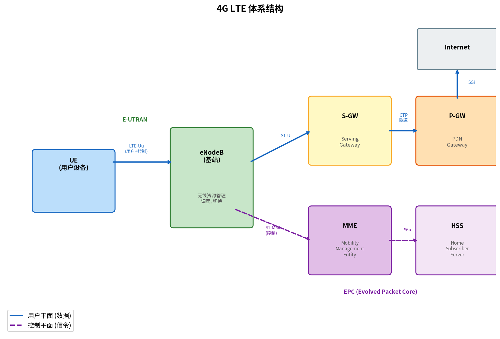

# 蜂窝网络因特网接入

> 参考：Kurose §7.4

蜂窝网络是全球覆盖范围最大的无线网络技术。从 1G 模拟语音到 4G LTE 高速数据再到 5G 万物互联，蜂窝网络的演进深刻改变了人们接入因特网的方式。

## 蜂窝网络的演进

| 代 | 年份 | 多址技术 | 核心特征 |
|----|------|---------|---------|
| 1G | 1980s | FDMA | 模拟语音，无数据 |
| 2G | 1990s | TDMA + FDMA (GSM) / CDMA (IS-95) | 数字语音、短信(SMS)、低速数据 |
| 2.5G | 2000s | GPRS / EDGE | 分组数据（≤384 kbps） |
| 3G | 2000s | W-CDMA / CDMA2000 | 移动宽带（≤42 Mbps HSPA+） |
| 4G | 2010s | OFDMA (LTE) | 全 IP 网络、高速数据（≤1 Gbps） |
| 5G | 2020s | OFDMA | 超高速（≤20 Gbps）、超低延迟、大规模 IoT |

## 4G LTE 体系结构

**长期演进（Long-Term Evolution, LTE）**是 4G 的核心标准。LTE 体系结构分为两大组件：

### 无线接入网：E-UTRAN

**演进型 UMTS 陆地无线接入网（Evolved UMTS Terrestrial Radio Access Network, E-UTRAN）**由大量**基站（eNodeB）**组成。每台 eNodeB 服务一个蜂窝（cell），通过无线接口（LTE-Uu）与用户设备（UE）通信。eNodeB 负责无线资源管理、调度、切换决策和无线承载控制。

### 核心网：EPC

**演进分组核心（Evolved Packet Core, EPC）**是 LTE 的全 IP 核心网络，包含四个关键网元：

| 网元 | 全称 | 功能 |
|------|------|------|
| **S-GW** | Serving Gateway | 用户平面锚点，连接 eNodeB 与 P-GW；UE 移动时维护数据路径 |
| **P-GW** | Packet Data Network Gateway | 连接外部 IP 网络（因特网），分配 IP 地址给 UE，执行策略和计费 |
| **MME** | Mobility Management Entity | 控制平面核心：UE 认证、位置跟踪、寻呼、S-GW 选择 |
| **HSS** | Home Subscriber Server | 用户数据库（IMSI、服务计划、认证密钥），相当于 3G 中的 HLR |

### LTE 用户平面与控制平面

**控制平面**（信令）路径：UE → eNodeB → MME → HSS（认证和承载建立过程中的信令交互）。eNodeB 与 MME 之间的接口为 **S1-MME**。

**用户平面**（数据）路径：UE → eNodeB → S-GW → P-GW → 因特网。eNodeB 与 S-GW 之间的接口为 **S1-U**，S-GW 与 P-GW 之间使用 **GTP（GPRS 隧道协议）**隧道。

这种控制与用户平面分离的架构是 LTE 的核心设计原则——数据路径短而高效，控制功能集中处理。

### 跨 eNodeB 切换时的数据路径管理

当 UE 从源 eNodeB 的覆盖范围移动到目标 eNodeB 时，需要维护数据路径的连续性。切换过程：

1. 源 eNodeB 向 MME 发送切换请求，MME 通知目标 eNodeB
2. 目标 eNodeB 分配资源，MME 向 S-GW 更新路径：将 UE 的 GTP 隧道从源 eNodeB 切换到目标 eNodeB
3. 源 eNodeB 将未确认的下行数据通过 X2 接口转发到目标 eNodeB
4. UE 与目标 eNodeB 建立连接，数据开始通过新路径传输

整个过程对上层应用透明——UE 的 IP 地址不变，TCP 连接不中断。

## 5G 的新特性

5G 网络标准（3GPP Release 15+）在 LTE 体系结构基础上做了重大演进：

### 5G 三大场景

| 场景 | 英文 | 关键指标 | 典型应用 |
|------|------|---------|---------|
| 增强移动宽带 | eMBB | 峰值 20 Gbps | 8K 视频、AR/VR |
| 超可靠低延迟 | URLLC | 1 ms 延迟、99.999% 可靠性 | 自动驾驶、远程手术 |
| 大规模机器类型通信 | mMTC | 100 万设备/平方公里 | IoT 传感器、智慧城市 |

### 5G 核心网（5GC）

5G 将核心网重构为**基于服务的架构（Service-Based Architecture, SBA）**，将 4G 中较大的网元分解为更小的微服务：

- **AMF（Access and Mobility Management Function）**：替代 MME 的移动性管理（仅控制平面）
- **SMF（Session Management Function）**：IP 地址分配、会话管理
- **UPF（User Plane Function）**：替代 S-GW/P-GW 的用户平面功能，灵活部署（可下沉到网络边缘）
- **AUSF / UDM / PCF**：认证服务器功能 / 统一数据管理 / 策略控制功能

这种虚拟化、服务化的架构使 5G 核心网可以运行在通用 x86 服务器上（网络功能虚拟化 NFV），而非专用硬件。5G 还支持**网络切片（network slicing）**——在同一物理基础设施上创建多个逻辑隔离的端到端虚拟网络，分别优化给 eMBB、URLLC 和 mMTC 场景。

### 5G 新无线（NR）

5G NR 引入新技术包括：毫米波频段（24–100 GHz，极大带宽但穿透力有限）、大规模 MIMO（数百根天线组成的阵列，可形成极窄的波束跟踪用户移动）、灵活的帧结构和参数集（时隙长度可变以满足低延迟场景）。

- [[无线网络概述]]
- [[无线链路特性]]
- [[MIMO]]
- [[移动性管理原理]]
- [[无线与移动性对TCP的影响]]
- [[接入网]]
- [[物理介质]]
- [[OFDM与OFDMA]]
- [[无线局域网安全]]
