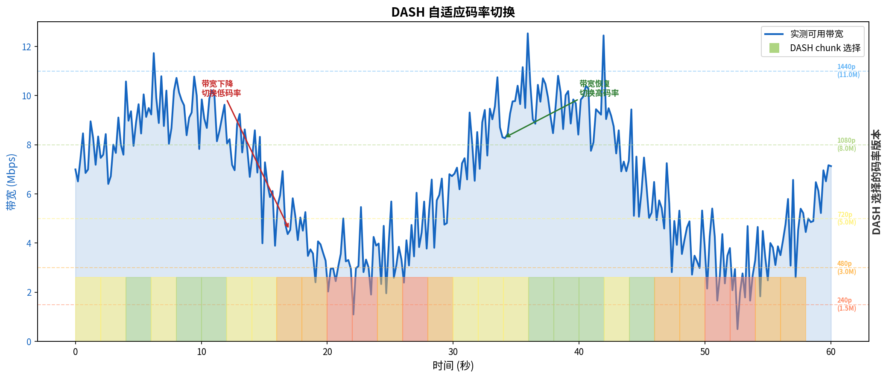

# 视频流与 CDN

> 参考：Kurose §2.6

视频流是因特网上带宽消耗最大的应用类型之一——Netflix 和 YouTube 等视频服务在高峰时段占据北美因特网下行流量的很大比例。视频流的核心挑战在于如何通过带宽可变、延迟不可预测的因特网传输高比特率的视频内容。

## 视频压缩

视频是一系列图像（帧）的高速序列，如果不压缩，原始数字视频的比特率极高。视频通过利用**冗余**进行压缩：

- **空间冗余（Spatial Redundancy）**：单帧内相邻像素之间的相似性——例如蓝天区域中相邻像素颜色几乎相同，不需要为每个像素单独编码
- **时间冗余（Temporal Redundancy）**：连续帧之间的相似性——大多数场景中，相邻帧之间只有少量像素发生变化。视频压缩仅编码**变化**的像素（通过差值或运动补偿），而非每帧的每个像素

压缩后视频的比特率取决于压缩算法和视频内容——如讲演视频（几乎静态）对比动作电影（大量运动）的比特率需求差异巨大。

## DASH（基于 HTTP 的动态自适应流）

传统的 HTTP 流（服务器以固定速率向客户端发送视频文件）存在严重问题——客户端带宽随时间变化，固定速率无法适应。**DASH（Dynamic Adaptive Streaming over HTTP）** 解决了这一问题：

1. 视频被编码为**多个不同比特率**的版本——每个版本对应不同的画质和带宽需求
2. 每个版本被切分为小的**块（chunk）**，每块通常为 2–10 秒的视频内容
3. 客户端维护一个**清单文件（manifest file / MPD）**，描述了不同版本的 URL 和每个版本的比特率
4. 客户端在播放过程中**动态测量**可用带宽，为每个即将到来的 chunk 选择最合适的比特率版本

DASH 使得客户端可以根据网络条件平滑切换视频质量——带宽充足时请求高比特率版本（高画质），带宽不足时请求低比特率版本（避免停顿）。这被称为**自适应流（adaptive streaming）**。

## CDN（内容分发网络）

### 挑战

因特网视频提供商面临两个巨大挑战：

1. **规模**：数亿用户同时观看视频，单个数据中心不堪重负
2. **距离**：用户可能位于世界各地，跨越大洋和大陆的路径延迟高、丢包率高

### CDN 原理

**CDN（Content Distribution Network）**通过在全球范围内部署大量分布式服务器来解决这些挑战。CDN 管理分布在不同地理位置的服务器，在其服务器上存储视频（和其他类型的 Web 内容）的副本，并尝试将每个用户请求引导到提供最佳用户体验的 CDN 位置。

CDN 采用的两种部署哲学：

- **Enter Deep（深入部署）**：将 CDN 服务器**深入到 ISP 接入网内部**，尽可能靠近最终用户。Akamai 是典型代表——在全球部署了数十万台服务器，分布在数千个位置（包括 ISP 网络内部），目标是最大化与用户的网络接近度，提高吞吐量并降低延迟。管理如此高度分散的基础设施是巨大挑战。
- **Bring Home（聚集部署）**：在关键 IXP（因特网交换点）处部署**大型服务器集群**，而非深入到 ISP 内部。Limelight 采纳此策略——部署的站点数量较少（几十到上百个），但每个站点的服务器集群规模庞大。管理更简单，但可能无法完全达到深入部署的低延迟水平。

### CDN 的工作原理

CDN 的关键机制是利用 **DNS 重定向**将用户请求引导到最近的 CDN 服务器。过程如下：

1. 用户访问 `www.netcinema.com`——浏览器向本地 DNS 服务器发起 `www.netcinema.com` 的 DNS 查询
2. 内容提供商的权威 DNS 服务器不返回自己的 IP 地址，而是返回**CDN 公司的主机名**（如 `a1105.kingcdn.com`）——这是一条 CNAME 记录
3. 用户的本地 DNS 服务器继续查询 `a1105.kingcdn.com`，进入 CDN 的权威 DNS 服务器
4. CDN 的 DNS 服务器根据**用户的本地 DNS 服务器的 IP 地址**（作为用户地理位置的近似），返回距离用户最近的 CDN 边缘服务器的 IP 地址
5. 用户浏览器收到 CDN 边缘服务器的 IP 地址后，直接向该服务器发起 TCP 连接和 HTTP GET 请求获取视频内容

### 集群选择策略

CDN 的集群选择策略——决定将用户引导到哪个服务器集群——是 CDN 的核心。常见策略包括：

- **地理最近（GeoDNS）**：根据请求的来源 IP 地址选择地理上最近的集群
- **实时测量**：定期测量各个集群到用户之间的延迟和吞吐量，选择性能最优的集群
- **基于负载**：考虑各集群的当前负载，避免将用户引导到过载的集群

大多数商业 CDN 综合使用多种策略。

## 案例研究：Netflix

Netflix 是全球领先的视频流媒体提供商。在高峰时段，Netflix 占据北美因特网下行流量的约 35%。Netflix 使用自己的专用 CDN（称为 **Open Connect**），其架构特点包括：

- 在关键 IXP 位置部署自己的服务器设备（**Open Connect Appliance, OCA**）
- 将最受欢迎的内容预先推送到这些 OCA（在非高峰时段进行大批量传输）
- 利用 Amazon Web Services（AWS）进行内容注册、用户认证和元数据管理
- DNS 重定向将用户请求引导到附近的 OCA

大型内容提供商（Google/YouTube、Netflix、Twitch 等）自建 CDN 的趋势日益明显——这赋予他们对服务交付方式的完全控制权，降低对第三方 CDN 提供商和上游 ISP 的依赖。

- [[应用层协议原理]]
- [[DNS]]
- [[HTTP]]
- [[Web缓存]]
- [[P2P文件分发]]
- [[流式存储视频]]
- [[多媒体网络应用概述]]
