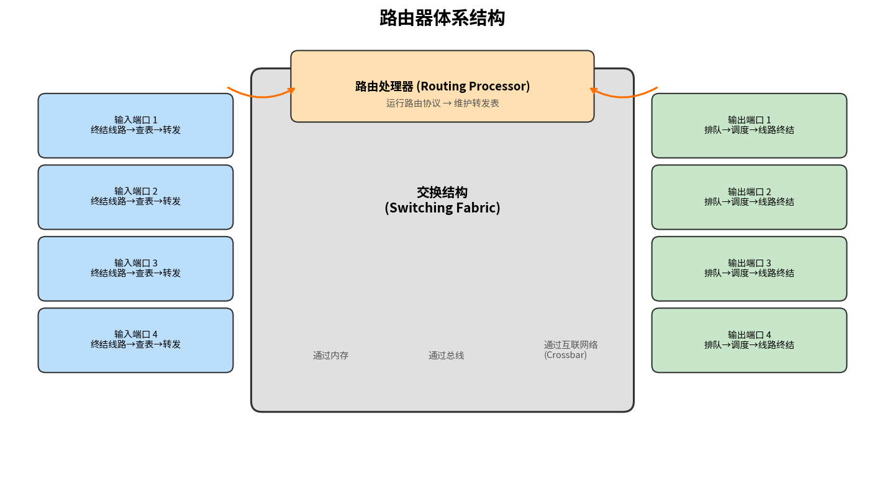

# 路由器体系结构

> 参考：Kurose §4.2.1–4.2.3

路由器是网络层的核心设备，负责将到达的分组从输入链路转发到适当的输出链路。理解路由器的内部结构对于掌握网络层数据平面的工作方式至关重要。

## 路由器的四个组件

一个通用路由器由四个组件构成：

**输入端口（Input Port）**：执行三项关键功能——（1）物理层功能：终结到达的物理链路；（2）链路层功能：与链路另一端互操作；（3）**查找（lookup）功能**：在输入端口查询转发表，确定到达的分组将通过交换结构转发到哪个输出端口。控制分组（如携带路由协议信息的分组）从输入端口转发到路由处理器。这里的"端口"指物理接口，与应用层套接字的端口号完全不同。

**交换结构（Switching Fabric）**：将路由器的输入端口连接到输出端口。交换结构完全包含在路由器内部——是网络路由器内部的网络。

**输出端口（Output Port）**：存储从交换结构接收的分组，并通过执行必要的链路层和物理层功能在出链路上传输这些分组。

**路由处理器（Routing Processor）**：执行控制平面功能。在传统路由器中，它执行路由协议、维护路由表和链路状态信息、计算转发表。在 SDN 路由器中，路由处理器负责与远程控制器通信以接收转发表条目。

输入端口、输出端口和交换结构**几乎总是用硬件实现**。考虑一条 10 Gbps 输入链路和一个 64 字节的 IP 数据报，输入端口只有**51.2 ns** 来处理一个数据报——远非软件可实现的速度。而控制平面功能（毫秒或秒级）通常用**软件**在路由处理器上实现。

## 输入端口处理与基于目的的转发

输入端口的查找是路由器操作的核心。考虑"最简单"的情况：输出端口仅基于分组的目的地址决定。对于 32 位 IP 地址，不可能为每个可能的地址维护一个转发表条目（超过 40 亿）。解决方案是使用**前缀匹配**：

| 前缀 | 链路接口 |
|------|---------|
| 11001000 00010111 00010 | 0 |
| 11001000 00010111 00011000 | 1 |
| 11001000 00010111 00011 | 2 |
| 否则 | 3 |

当一个目的地址可能匹配多个条目时，路由器使用**最长前缀匹配规则（longest prefix matching）**——选择匹配长度最长的条目（详见 [[IPv4编址]]）。

在吉比特速率下，查找必须在纳秒内完成，因此不仅要用硬件实现，还需要超越简单线性搜索的技术。实践中常使用**TCAM（Ternary Content Addressable Memory）**——向内存呈现 32 位 IP 地址，在常数时间内返回对应转发表条目的内容。

输入端口处理中还包含"匹配加动作"（match plus action）的抽象——不仅路由器使用这一范式，链路层交换机（匹配链路层地址）、防火墙（匹配条件后丢弃）和 [[NAT]]（匹配端口号后重写）也使用同一抽象。

## 交换结构

交换结构是路由器的核心，可通过以下方式实现：

### 经由内存交换

最早的路由器是传统计算机，交换由 CPU 直接控制。分组通过中断从输入端口复制到处理器内存，处理器查找输出端口后再复制到输出端口。如果内存带宽为每秒 B 个分组，则总转发吞吐量必须**小于 B/2**（因为每次转发需要一次写和一次读）。现代共享内存交换路由器将查找和存储交由线路卡上的处理器完成，类似于共享内存多处理器。

### 经由总线交换

输入端口通过**共享总线**将分组直接传输到输出端口，无需路由处理器干预。输入端口在分组前附加一个交换机内部标签（指示输出端口），所有输出端口都接收该分组，但只有匹配标签的端口保留分组。因为一次只能有一个分组跨越总线，交换速度受限于总线速度。Cisco 6500 在 32 Gbps 背板总线上交换分组。

### 经由互联网络交换

使用更复杂的互联网络（如**纵横式交换机 Crossbar Switch**）克服单一共享总线的带宽限制。Crossbar 由 2N 条总线连接 N 个输入端口和 N 个输出端口。每个垂直和水平总线在交叉点（crosspoint）交汇，交叉点可由交换结构控制器随时打开或关闭。Crossbar 是**非阻塞（non-blocking）**的——只要没有其他分组正在转发到同一输出端口，分组就不会被阻塞。Cisco 12000 系列使用 crossbar 交换网络。

更复杂的互联网络使用多级交换元素，允许不同输入端口的分组同时向同一输出端口前进。路由器的交换容量也可以通过并行运行多个交换结构来扩展。

- [[网络层概述]]
- [[路由器排队与调度]]
- [[IPv4数据报格式]]
- [[通用转发与SDN数据平面]]
- [[链路层交换机]]
- [[网络管理与SNMP]]
- [[IP分片]]
- [[IPv4编址]]
