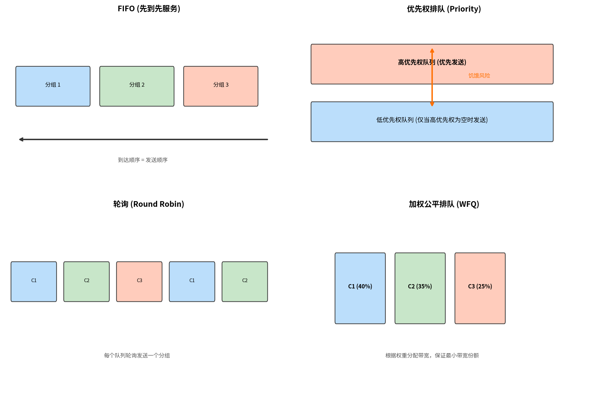

# 路由器排队与调度

> 参考：Kurose §4.2.4–4.2.5

分组队列可以在路由器的**输入端口和输出端口**同时形成。队列的位置和规模取决于流量负载、交换结构的相对速度和线路速度。当队列增长过大时，路由器的内存最终会耗尽，**分组丢失（packet loss）**就会发生——这就是我们所说的"分组在网络中丢失"或"在路由器处被丢弃"的实际发生地。



## 输入排队与 HOL 阻塞

当交换结构不够快（相对于输入线路速度）以至于无法无延迟地传输所有到达分组时，分组必须在输入端口排队等待通过交换结构。

考虑一个 crossbar 交换结构，假定（1）所有链路速度相同；（2）一个分组从输入端口传输到输出端口的时间等于在输入链路上接收一个分组的时间；（3）分组以 FCFS 方式从输入队列移动到输出队列。如果两个输入队列前端的两个分组都发往同一输出队列，则其中一个分组将被阻塞——交换结构一次只能向一个给定输出端口传输一个分组。

更严重的是，不仅被阻塞的分组必须等待，排在它后面的分组也必须等待，**即使这些后续分组的输出端口是空闲的**。这种现象称为**队头阻塞（Head-of-the-Line, HOL blocking）**。研究表明，由于 HOL 阻塞，输入端口可达到的最大吞吐量被限制为线路容量的 **58%**（在特定假设下）；换言之，即使输入链路满负荷，有效通过交换结构的分组速率也仅为线路速率的 58%。

## 输出排队

即使交换结构比端口线路速度快 N 倍，输出端口排队仍然可能发生。假设到达 N 个输入端口的分组全部发往同一输出端口，在发送一个分组到出链路的时间内，N 个新分组将到达该输出端口。由于输出端口每单位时间只能传输一个分组，这 N 个分组必须排队。

当没有足够内存缓冲到达的分组时，必须做出决定：**丢弃到达的分组**（称为**弃尾 drop-tail 策略**）或**移除已排队的分组**为新分组腾出空间。**主动队列管理（Active Queue Management, AQM）**算法在缓冲区满之前主动丢弃（或标记）分组以向发送方提供拥塞信号。最著名的 AQM 算法之一是**随机早期检测（Random Early Detection, RED）**算法（与 [[ECN]] 紧密配合）。

关于缓冲区大小：多年的经验法则是 B = RTT × C（如 10 Gbps 链路 × 250 ms RTT = 2.5 Gbits 缓冲区）。但更新的研究表明，当大量 TCP 流（N）通过一条链路时，所需缓冲区约为 B = RTT × C / √N，这意味着在大型骨干链路中所需缓冲区显著减少。

## 分组调度

分组调度（packet scheduling）决定输出端口排队的分组以**何种顺序**在出链路上传输。所有调度算法都围绕一个核心目标：在多条流共享同一条出链路时，如何在它们之间分配链路带宽。以下从简到繁逐一讨论。

### 1. 先入先出（FIFO / FCFS）

FIFO（First-In First-Out）就是**排队**——唯一的一条队列，不分等级、不分类别。先到达的分组先发送，后来的排在后面。

```
到达顺序:   A1 → A2 → B1 → A3 → B2
             │    │    │    │    │
             └────┴────┴────┴────┘
                      │
队列:        [A1][A2][B1][A3][B2]
                      │
发送顺序:    A1 → A2 → B1 → A3 → B2
```

FIFO 的唯一策略是**弃尾（drop-tail）**：队列满了再来的分组直接丢弃。FIFO 没有任何公平性概念——谁发得快谁就占得多，一条贪婪的 UDP 流可以挤占所有带宽。尽管如此，FIFO 因其极简实现成为最普遍的调度方式。

### 2. 优先权排队（Priority Queuing）

优先权排队引入**多条队列**，按优先级区分。分组到达时根据首部字段（如 DSCP、协议类型）被**分类**到不同的优先级队列。调度器始终先服务高优先级队列，只有高优先级队列为空时才处理低优先级。

```
高优先级队列（VoIP）:  [V1][V2]
低优先级队列（邮件）:  [E1][E2][E3][E4][E5]

发送顺序:  V1 → V2 → E1 → E2 → E3 → E4 → E5
           ↑        ↑
          高优先耗尽后才轮到低优先
```

默认是**非抢占式（non-preemptive）**：即使一个高优先级分组在低优先级分组发送期间到达，也必须等当前分组传完。否则正在线路上传输的一半分组就会变成垃圾。

**饥饿（starvation）**是优先权排队的致命缺陷：如果高优先级流量持续不断（例如 VoIP 通话持续数小时），低优先级队列**永远得不到服务**。因此纯优先权排队在实际网络中很少单独使用——它需要配合速率限制（policing）来防止高优先级流量失控。

典型应用：VoIP 分组延迟敏感必须优先；网络管理分组（如 OSPF Hello）即使拥塞也不能丢；普通文件传输延迟几秒无感。

### 3. 循环排队（Round Robin）

Round Robin 也使用多条队列分类，但**没有优先级之分**。调度器在非空队列之间**轮流**，从每个队列各取一个分组发送。如果某个队列为空，直接跳过，不浪费时间空等——这就是**工作保存（work-conserving）**：只要有任何分组在排队，链路绝不空闲。

```
队列1（视频）: [V1][V2][V3]
队列2（网页）: [W1]
队列3（邮件）: [E1][E2]

发送顺序:  V1 → W1 → E1 → V2 → E2 → V3
          1    2    3    1    3    1
                         ↑
              轮到队列2时已空，跳过
```

Round Robin 在**分组数量**层面公平——每个队列每次轮到一个发送机会。但是，不同队列的分组大小可能差异很大：如果队列1的每个分组都 1500 字节，队列2的每个分组只有 500 字节，那么队列1实际拿到的带宽是队列2的三倍。Round Robin 的"公平"不意味着带宽公平。

### 4. 加权公平排队（WFQ）

WFQ（Weighted Fair Queuing）是 Round Robin 的推广，解决了两个问题：（1）赋予不同等级**不同的权重**；（2）实现**带宽层面**的公平，而非分组数量层面的公平。

#### 权重与保证速率

每个等级 $i$ 被分配一个权重 $w_i$。链路总速率为 $R$，等级 $i$ 在任何有分组排队的时间间隔内**保证**获得至少：

$$R \times \frac{w_i}{\sum_j w_j}$$

的吞吐量。这不是上限——空闲的份额可以被其他等级借用（工作保存），这是**保证下限（minimum guarantee）**。

**具体例子**：链路 R = 10 Mbps。三个等级：

| 等级 | 权重 | 保证速率 | 占比 |
|:---|:---:|:---|:---:|
| 视频 | 5 | 5 Mbps | 50% |
| 网页 | 3 | 3 Mbps | 30% |
| 邮件 | 2 | 2 Mbps | 20% |

当所有三个等级都有分组排队时，各得保证份额。但当邮件队列为空时，邮件闲置的 2 Mbps **不会浪费**——WFQ 是工作保存的，空闲份额按活跃队列的权重比例重新分配：

- 活跃总权重 = 5 + 3 = 8
- 视频实际分到：$10 \times \frac{5}{8} = 6.25$ Mbps（多了 1.25 Mbps）
- 网页实际分到：$10 \times \frac{3}{8} = 3.75$ Mbps（多了 0.75 Mbps）

一旦邮件分组再次到达，调度器逐步调整，视频和网页的份额平滑收敛回各自的保证速率。

#### 为什么不是简单地"交替发送"？

Round Robin 按「每个队列各取一个分组」轮转。WFQ 如果也按此方式——权重 5 的发 5 个、权重 3 的发 3 个、权重 2 的发 2 个——虽然长期比例正确，但短时间尺度上会出现突发（视频一下子占满链路发 5 个分组，网页和邮件在此期间完全等待）。更根本的问题是：**分组大小不同时，按分组计数分配不等于按带宽分配**——如前所述，1500 字节的分组和 500 字节的分组轮流转发，实际带宽并不公平。

WFQ 通过**模拟逐比特加权轮转（bit-by-bit weighted round robin）**来解决这个问题：

**假想模型**：调度器能以逐比特粒度在流之间轮转，一轮中流 $i$ 获得 $w_i$ 个比特的服务机会。在这个假想世界中，一个长度为 $L$ 比特的分组需要 **$L / w_i$ 个轮**才能传完。该分组最后一比特传完时的轮数，就是它的**虚拟完成时间（virtual finish time）**。

**例子**：链路归一化，A（w=5）、B（w=3）的分组同时到达：

| 流 | 权重 | 分组长度 | 虚拟完成时间 |
|:---|:---:|:---|:---|
| A | 5 | 100 比特 | 100 / 5 = **20 轮** |
| B | 3 | 30 比特 | 30 / 3 = **10 轮** |

在假想模型中 B 10 轮就传完了，A 还需 20 轮。B 的虚拟完成时间更早 → **实际发送顺序 B 先、A 后**。注意 A 的权重虽然大（5 > 3），但分组也更长（100 > 30），两者抵消后反而是 B 优先——WFQ 让**分组大小和权重共同决定顺序**，而不是像 Round Robin 那样对分组大小视而不见。

**实际实现**：硬件不可能真的逐比特切换。WFQ 的做法是纯算术——维护一个虚拟时钟 $R(t)$（记录假想世界已完成多少轮），新分组到达流 $i$ 时计算：

$$\text{虚拟完成时间} = \max(R(t),\ \text{该流上一个分组的虚拟完成时间}) + \frac{L}{w_i}$$

所有排队分组按虚拟完成时间从小到大排序，依次发送。权重高的流 $L/w_i$ 倾向更小，虚拟完成时间更早，更频繁被调度——但大分组仍会适当排队，低权重流不会饿死。最终效果：**各流获得的服务量精确趋近于其权重比**，无论分组大小如何。这是 Round Robin 做不到的。

### 四种调度对比

|      | FIFO | Priority Queuing | Round Robin  | WFQ         |
| ---- | ---: | ---------------: | :----------: | :---------- |
| 队列数  |    1 |                多 |      多       | 多           |
| 公平性  |    无 |       无（高优先绝对优先） | 分组数量公平，带宽不公平 | 带宽保证公平      |
| 隔离性  |    无 |  强（高优先级不受低优先级影响） |  有（各队列相互隔离）  | 强（权重保证最小带宽） |
| 饥饿风险 |    无 |      有（低优先级可能饿死） |      无       | 无           |
| 工作保存 |    — |  否（低优先等待时链路可能空闲） |      是       | 是           |
| 复杂度  |   最低 |                低 |      中       | 高           |

WFQ 在实际路由器中被广泛部署，通常与 [[服务质量|Diffserv]] 的服务等级（EF、AF、BE）配合使用——例如 EF（VoIP）获得高权重保证低延迟，AF 各子类获得中等权重，BE 获得剩余权重。

- [[路由器体系结构]]
- [[拥塞控制原理]]
- [[AQM与RED]]
- [[ECN]]
- [[网络层概述]]
