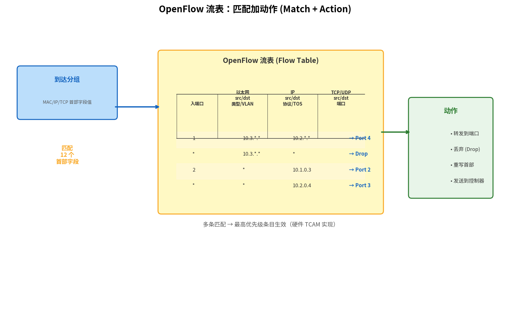

# 通用转发与 SDN 数据平面

> 参考：Kurose §4.4

## 传统转发的局限：只认目的地址

回顾一下传统路由器是怎么转发分组的：检查到达分组的**目的 IP 地址**，在转发表中做最长前缀匹配，找到输出端口，发出去。仅此而已。

这个模型在过去几十年运行良好，但网络运营商逐渐发现它不够用：

- 想**阻止**来自某个源 IP 的流量？需要单独部署**防火墙**。
- 想让 VoIP 流量走低延迟路径、文件传输走大带宽路径？需要**流量工程**。
- 想在不同出链路上均衡分发流量？需要**负载均衡器**。
- 想把私有地址映射到公网地址？需要 **[[NAT]]** 设备。

每种需求催生了一种专用硬件——防火墙、负载均衡器、NAT 盒、DPI 设备——统称**中间盒（middlebox）**。它们各有各的配置方式、管理界面、升级周期。网络变成了一个功能强但管理混乱的集合体。

**SDN 的洞察**：这些设备干的本质上是同一件事——检查分组的某些字段，然后决定做什么。如果把「检查」统一为**匹配（match）**，把「决定」统一为**动作（action）**，那所有这些功能可以用一个通用的转发设备来完成，只需改变匹配规则和动作列表。

## 匹配加动作：通用转发范式

传统转发的唯一匹配字段是**目的 IP 地址**，唯一动作是**转发到某个端口**。通用转发把这两者都泛化了：

| | 传统转发 | 通用转发 |
|:---|:---|:---|
| **匹配什么？** | 仅目的 IP 地址 | 链路层、网络层、运输层中任意字段的组合 |
| **做什么？** | 转发到指定端口 | 转发、丢弃、重写首部、发送到控制器…… |
| **如何配置？** | 路由协议自动计算 | 控制器通过标准接口编程下发 |

「匹配加动作」的核心在于：**一条规则 = 一组匹配条件 + 匹配后执行的动作**。规则储存在**流表（flow table）**中——这是传统转发表的泛化版本。

## 流表的结构

流表中每个条目包含三个部分：

1. **匹配字段**：分组首部中哪些字段的值构成匹配条件。可以使用通配符（如 `10.0.*.*` 匹配整个子网）
2. **优先权**：如果分组同时匹配多个条目，选优先权最高的
3. **动作**：匹配后执行的操作

由于匹配可以基于源/目的 MAC 地址和源/目的 IP 地址，这些通用转发设备更准确地称为**分组交换机（packet switch）**——它同时具备路由器和链路层交换机的特征。

## 从转发表到流表：逐步扩展

下面用一个具体例子展示流表如何通过增加匹配字段和动作类型，逐步实现各种网络功能。假设有一台分组交换机 S1，4 个端口：

```
  端口1 → 主机 A (10.0.0.1)
  端口2 → 主机 B (10.0.0.2)
  端口3 → 主机 C (10.0.1.1)
  端口4 → 通往外网的链路
```

### 第一步：简单转发（就是传统转发表）

```
匹配: DstIP = 10.0.0.1  → 动作: Forward(1)  [优先权: 1]
匹配: DstIP = 10.0.0.2  → 动作: Forward(2)  [优先权: 1]
匹配: DstIP = 10.0.1.1  → 动作: Forward(3)  [优先权: 1]
匹配: DstIP = *.*.*.*    → 动作: Forward(4)  [优先权: 0, 默认]
```

这就是传统路由器做的事——只匹配目的 IP，只转发。

### 第二步：加入防火墙规则

> 需求：不允许主机 C（10.0.1.1）访问主机 B（10.0.0.2）。

只需在匹配字段中增加**源 IP**：

```
匹配: SrcIP=10.0.1.1, DstIP=10.0.0.2  → 动作: Drop     [优先权: 10]
匹配: DstIP = 10.0.0.1                  → 动作: Forward(1) [优先权: 1]
匹配: DstIP = 10.0.0.2                  → 动作: Forward(2) [优先权: 1]
...
```

防火墙规则（优先权 10）覆盖了普通转发规则（优先权 1）——如果分组**同时匹配**这两条，优先权高的先执行。注意：传统路由器做不到这一点——它的转发表没有「源 IP」列。

### 第三步：加入 NAT

> 需求：内部主机向外网发数据时，源 IP 替换为公网地址。

在动作中增加**重写首部**：

```
匹配: SrcIP=10.0.*.*, InPort≠4  → 动作: Rewrite SrcIP→203.0.113.5, Forward(4) [优先权: 1]
匹配: DstIP=203.0.113.5          → 动作: Rewrite DstIP→10.0.0.1, Forward(1)    [优先权: 1]
...
```

第一条把内部发出的分组源地址改写为公网 IP；第二条把回程分组的目的地址改回内部主机地址。传统网络需要单独部署 NAT 盒；这里只是一条流表规则。

### 第四步：负载均衡

> 需求：到外网的流量在端口 4 和端口 5 之间均分。

动作可以不是「转发到固定端口」，而是**转发到一个端口组**：

```
匹配: DstIP ≠ 10.0.*.*  → 动作: Forward(group=WAN-ports)
                                            [WAN-ports 含 port4, port5]
```

交换机会在端口组中轮转选择，两条出链路各承载约一半流量。

## 匹配字段可以覆盖协议栈各层

从上面例子可以看出，匹配条件可以跨越整个协议栈。以 **OpenFlow 1.0**（SDN 的标杆标准）为例，支持匹配的 12 个字段按层次分组：

| 层次 | 字段 |
|:---|:---|
| **入端口** | 分组从哪个物理端口到达 |
| **链路层** | 源 MAC 地址、目的 MAC 地址、以太类型、VLAN ID、VLAN 优先级 |
| **网络层** | 源 IP 地址、目的 IP 地址、IP 协议号、IP ToS/DSCP |
| **运输层** | 源端口号、目的端口号 |



所有匹配字段都可以使用通配符（如 `10.0.*.*`），每条规则有独立的优先权值。分组到达后，硬件（TCAM）**并行**在所有流表条目中查找，选中优先权最高的匹配条目。如果没有任何条目匹配，分组被丢弃或发送给控制器处理。

## 动作类型

| 动作                      | 含义                               |
| :---------------------- | :------------------------------- |
| **Forward(port)**       | 转发到指定物理端口                        |
| **Forward(controller)** | 封装分组并发送给远程 SDN 控制器（控制器软件决定如何处理）  |
| **Drop**                | 丢弃分组（流表条目中无动作即表示丢弃）              |
| **Modify-field**        | 重写首部字段值（如修改源 IP、目的 MAC、VLAN 标签等） |
| **Forward(group)**      | 转发到一组端口（用于负载均衡、组播）               |

## 通用转发的意义

流表本质上是一个 **API**——通过编写流表规则，网络管理员可以用软件定义单个分组交换机的行为，无需更换硬件。将全网所有交换机统一编程，就能实现：

- **虚拟网络**：同一组物理交换机和链路上，不同租户看到逻辑上完全隔离的网络
- **流量工程**：控制特定流量的端到端路径，不依赖路由协议自动选路
- **安全策略**：全网统一的访问控制和隔离策略，而非逐设备配置

SDN 的数据平面（通用转发）和控制平面（逻辑集中式控制器）分离，使得网络的编程模型从「配置每个设备的专有命令行」转变为「用软件定义全网行为」。

- [[网络层概述]]
- [[SDN控制平面]]
- [[路由器体系结构]]
- [[NAT]]
- [[链路层交换机]]
- [[MPLS与链路虚拟化]]
