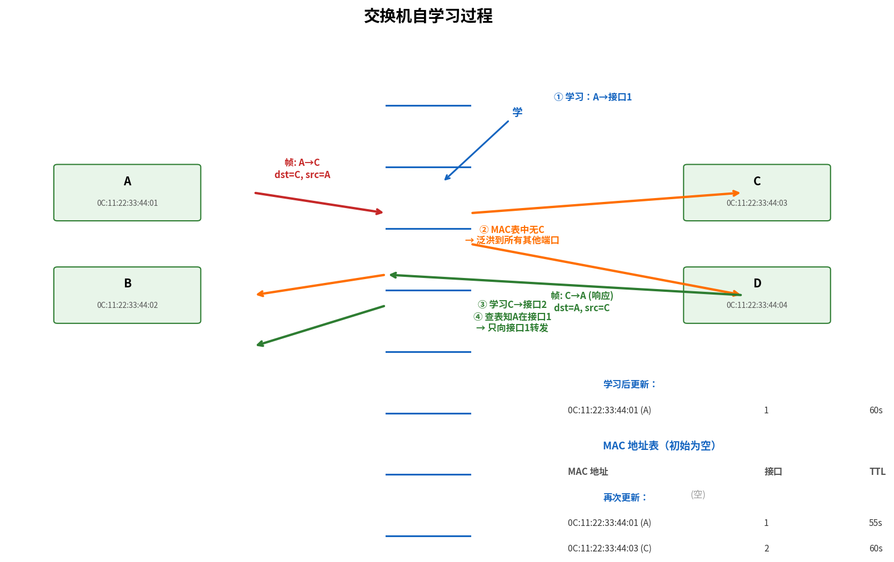

# 链路层交换机

> 参考：Kurose §6.4.3

链路层交换机（link-layer switch）是工作在链路层的分组交换设备，负责在**同一子网内**基于 MAC 地址转发帧。路由器工作在网络层，基于 IP 地址在不同子网间转发数据报。交换机是**即插即用**的，不需要网络管理员配置即可工作。

## 交换机的基本功能

交换机同时在**所有接口**上运行链路层协议。它接收到达的链路层帧，根据目的 MAC 地址选择性地**转发到特定输出接口**，而非向所有接口泛洪（如集线器/hub）。

## MAC 地址表的自学习

交换机的核心是**MAC 地址表（switch table）**，记录 `<MAC地址, 接口, 时间>` 的映射。与路由器的转发表不同，交换机的 MAC 地址表不是由路由协议计算得到的，而是**自动构建**的——通过观察到达帧的源 MAC 地址和到达接口。

**自学习（self-learning）过程**：

1. 交换机初始时 MAC 地址表为空
2. 当帧从接口 x 到达时，交换机记录帧的**源 MAC 地址**与接口 x 的关联，存入 MAC 表并记下当前时间
3. 若在**老化时间（aging time）**内未再收到该 MAC 地址作为源的帧，交换机从表中删除对应条目（典型为 60 秒）

**基本特性**：
- 交换机是**即插即用设备（plug-and-play device）**——无需配置即可工作
- 交换机是**全双工（full-duplex）**的——任意接口可同时发送和接收

## 帧的转发与过滤

当帧到达时，交换机根据 MAC 表决定："此帧应向哪个接口转发？"

| 情况 | 动作 | 名称 |
|------|------|------|
| 目的 MAC 在表中且接口 ≠ 到达接口 | 仅向表中记录的接口转发 | **转发（Forwarding）** |
| 目的 MAC 在表中但接口 = 到达接口 | 丢弃帧（目的地和源在同一网段，无需交换） | **过滤（Filtering）** |
| 目的 MAC **不在**表中 | 向除到达接口外的**所有接口**泛洪 | **泛洪（Flooding）** |
| 目的 MAC 为广播地址 `FF-FF-FF-FF-FF-FF` | 向所有接口泛洪 | **广播** |

过滤功能是交换机提升 LAN 性能的关键——它隔离了不相干的流量，每个 LAN 网段上的主机只看到发往自己的帧。

## 交换机的特性总结

**消除碰撞**：交换机的每个接口连接一个独立的 LAN 网段（点对点全双工链路），不同接口的传输不会碰撞。因此交换机式以太网**不使用 CSMA/CD**。

**异质链路支持**：交换机缓存帧，允许不同速率/不同介质的链路互连（如一个接口 100 Mbps 铜缆，另一个 1 Gbps 光纤）。

**安全与监控**：交换机可以隔离流量（交换机能将帧送达唯一有目标主机的接口，从而使嗅探更困难），但也带来**交换机投毒（switch poisoning）**攻击——攻击者发送大量伪造源 MAC 的帧填满 MAC 地址表，迫使交换机退化为集线器模式（大量泛洪）。

## 交换机 vs 路由器

路由器和交换机之间的比较是理解网络层次结构的关键：

| 维度 | 路由器 | 链路层交换机 |
|------|--------|------------|
| 工作层次 | 网络层（第 3 层） | 链路层（第 2 层） |
| 转发依据 | IP 地址（最长前缀匹配） | MAC 地址（精确匹配） |
| 转发表来源 | 路由协议（OSPF/BGP）或 SDN 控制器 | **自学习**（观察源 MAC 地址） |
| 分组修改 | 修改 TTL、检验和等 IP 字段 | **不修改**帧内容 |
| 广播域 | **隔离广播域**（不转发广播分组） | **不隔离广播域**（泛洪广播帧） |
| 即插即用 | 需要配置（IP 地址、路由协议） | 是，无需配置 |
| 拓扑位置 | 子网之间（网络核心） | 同子网内（接入网） |
| 服务模型 | 尽力而为 | 尽力而为 |

两个设备都对层次至关重要——小型网络可仅用交换机连接，大型网络（因特网）需要路由器隔离广播域和路由分组。

- [[链路层概述]]
- [[路由器体系结构]]
- [[以太网]]
- [[VLAN]]
- [[STP]]
- [[数据中心网络]]
- [[网络层概述]]
