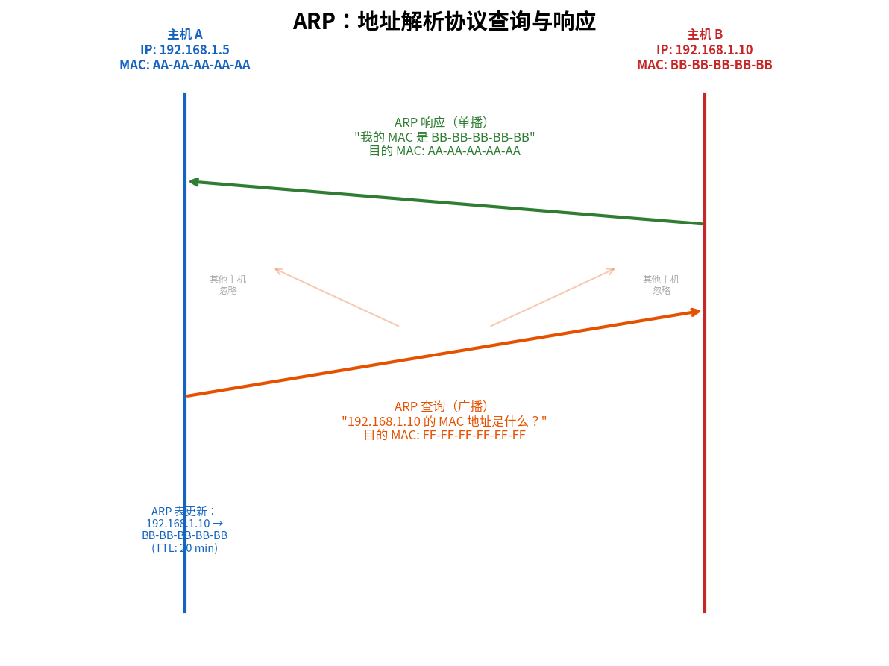

# 链路层寻址与ARP

> 参考：Kurose §6.4.1

主机和路由器既有网络层地址（IP），也有链路层地址（MAC）。这里需要回答两个根本问题：为什么需要两层地址？它们是如何协同工作的？

## MAC 地址

严格来说，**不是主机或路由器具有链路层地址**，而是它们的**适配器（网络接口）**具有链路层地址。具有多个网络接口的主机或路由器就有多个链路层地址。

链路层地址有多种叫法——**LAN 地址、物理地址、MAC 地址**。MAC 地址长 **6 字节（48 比特）**，通常以十六进制表示，如 `1A-2B-3C-4D-5E-6F`。

### MAC 地址的结构与管理

MAC 地址由 **IEEE** 管理分配。制造商购买的 MAC 地址空间由两部分组成：前 24 比特为**组织唯一标识符（OUI, Organizationally Unique Identifier）**，由 IEEE 分配给具体厂商；后 24 比特由厂商自行为其适配器分配。

MAC 地址的**扁平结构**与 IP 地址的层次结构形成关键对比：无论适配器移动到何处，其 MAC 地址不变（类似身份证号），而 IP 地址随子网变化（类似邮政地址，包含"国家→省→市"的层次信息）。正是这种差异使得 IP 路由（基于层次聚合）在大规模网络中可行。

### MAC 地址的类型

| 类型 | 特征 | 目的地址示例 |
|------|------|-------------|
| 单播（Unicast） | 第一字节的最低位为 0 | 指向特定适配器 |
| 广播（Broadcast） | 48 个比特全为 1 | `FF-FF-FF-FF-FF-FF` |
| 多播（Multicast） | 第一字节的最低位为 1 | 如 `01-00-5E-xx-xx-xx`（IPv4 多播映射）|

广播地址 `FF-FF-FF-FF-FF-FF` 被交换机的所有适配器接收。多播 MAC 用于将第 3 层多播组地址映射到第 2 层地址（如 IGMP/多播路由、STP BPDU 使用 `01-80-C2-00-00-00`、ICMPv6 邻居发现等），帧发送给一组特定的适配器。

## ARP：地址解析协议

**地址解析协议（Address Resolution Protocol, ARP）**提供了 IP 地址到 MAC 地址的**动态映射**。当主机需要向同一子网中某个 IP 地址发送数据报时，需要知道目标的 MAC 地址来构造链路层帧。

### ARP 的工作过程

假设主机 A（IP: 192.168.1.1）要向主机 B（IP: 192.168.1.2）发送数据报，但不知道 B 的 MAC 地址。

**步骤**：

1. **查询**：A 广播 **ARP 查询分组**（目的 MAC = `FF-FF-FF-FF-FF-FF`），内容为："谁的 IP 是 192.168.1.2？请告诉我你的 MAC 地址。"

2. **响应**：子网中所有适配器都收到该 ARP 查询帧，但只有 IP 匹配的主机 B 用 **ARP 响应分组**（单播回 A）回复："我的 IP 是 192.168.1.2，我的 MAC 是 BB-BB-BB-BB-BB-BB。"

3. **缓存**：A 将 B 的 IP-MAC 映射存入 **ARP 表（ARP table）**。ARP 表中的每个条目有一个**过期时间（TTL）**（典型为 20 分钟），过期后删除。

### ARP 分组结构

| 字段 | 说明 |
|------|------|
| 硬件类型 | 链路层类型（以太网 = 1） |
| 协议类型 | 网络层协议（IPv4 = 0x0800） |
| 硬件地址长度 | MAC 地址长度（6 字节） |
| 协议地址长度 | IP 地址长度（4 字节） |
| 操作码 | ARP 请求 = 1，ARP 响应 = 2 |
| 发送方 MAC + IP | 发送方链路层地址和网络层地址 |
| 目标 MAC + IP | 目标的链路层地址和网络层地址 |

ARP 分组封装在**链路层帧**中传输（而非 IP 数据报），因此严格来说 ARP 是**跨网络层和链路层的协议**。

### ARP 安全性

ARP 是无状态的、无认证的协议。攻击者可以发送**伪造的 ARP 响应**——称为 **ARP 欺骗（ARP spoofing）**——将 IP 映射到攻击者的 MAC 地址，从而实现中间人攻击或拒绝服务。防御措施包括静态 ARP 条目和动态 ARP 检查（DAI）。

- [[链路层概述]]
- [[IPv4编址]]
- [[以太网]]
- [[链路层交换机]]
- [[Web请求的一天]]
- [[计算机网络安全概述]]
