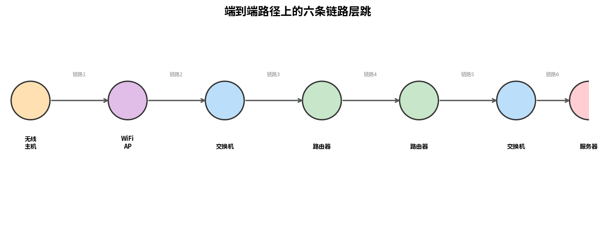

# 链路层概述

> 参考：Kurose §6.1

链路层（link layer）是协议栈中网络层之下的层次，负责在**相邻节点之间**通过单条通信链路传输数据。网络层负责端到端的路由，而链路层负责将数据报从路径上的一个节点移动到**下一个节点**。本章将链路层协议运行的任何设备称为**节点（node）**，包括主机、路由器、交换机和 WiFi 接入点；将连接相邻节点的通信通道称为**链路（link）**。

[[运输层概述|运输层]]提供进程到进程的逻辑通信，[[网络层概述|网络层]]提供主机到主机的逻辑通信，而链路层提供**节点到节点的逻辑通信**。一个数据报从源主机到目的主机需要穿越多条链路（如图，无线主机到服务器经过了六条链路），每条链路上可能运行**不同的链路层协议**（WiFi、以太网、DOCSIS 等），各自以不同的方式提供服务。

## 链路层提供的服务

尽管任何链路层的基本服务都是将数据报从一个节点移动到相邻节点，但不同协议提供的具体服务可能不同。链路层协议可能提供的服务包括：

**成帧（Framing）**：几乎所有链路层协议都将网络层数据报封装在**链路层帧（frame）**中再传输。帧包含数据字段（网络层数据报）和若干首部字段。帧的具体结构由链路层协议规定。

**链路接入（Link Access）**：**介质访问控制（Medium Access Control, MAC）协议**规定了帧如何传输到链路上。对于仅有一个发送方和一个接收方的点对点链路，MAC 协议很简单（甚至不存在）——发送方在链路空闲时即可发送。更有趣的情况是多个节点共享**单个广播链路**——称为**多路访问问题（multiple access problem）**，此时 MAC 协议负责协调多节点的帧传输。

**可靠交付（Reliable Delivery）**：某些链路层协议保证将每个网络层数据报无差错地通过链路传输。类似于运输层的可靠交付，链路层可靠交付通过**确认（ACK）**和**重传**实现。它通常用于差错率高的链路（如无线链路），目的是在出错链路上本地纠正错误，避免端到端重传。对于低比特差错的链路（光纤、同轴电缆、许多双绞铜线），链路层可靠交付被视为不必要的开销，因此许多有线链路层协议不提供此服务。

**差错检测与纠正（Error Detection and Correction）**：接收方的链路层硬件可能将 0 误判为 1 或反之，这是由信号衰减和电磁噪声引起的。链路层通常提供比运输层检验和更复杂的差错检测，并且在硬件中实现。**前向纠错（Forward Error Correction, FEC）**不仅可以检测错误，还能精确定位并纠正错误，常用于音频 CD 等存储设备和深空通信场景。

## 链路层的实现位置

链路层在**网络适配器（network adapter / NIC）**中实现，是协议栈中**软件与硬件交汇**的地方。

- **发送方**：控制器将高层交给的数据报封装为链路层帧（填充各字段），按链路接入协议将帧传输到通信链路上。
- **接收方**：控制器接收整个帧，提取网络层数据报。若协议包含差错检测，发送控制器设置差错检测位，接收控制器执行差错检测。
- **硬件部分**：链路层控制器通常是**单一的专用芯片**，用硬件实现大部分链路层服务（成帧、链路接入、差错检测等）。例如 Intel 710 适配器实现以太网协议，Atheros AR5006 控制器实现 802.11 WiFi 协议。
- **软件部分**：运行在主机 CPU 上的链路层软件实现高层功能，如组装链路层寻址信息、激活控制器硬件、响应控制器中断、处理错误状态、将数据报上交网络层。

> 运输层通常由软件实现（如操作系统的一部分），链路层通常由硬件实现，这是运输层检验和与链路层 CRC 的分工根源。

- [[多路访问协议]]
- [[差错检测与纠错]]
- [[链路层寻址与ARP]]
- [[以太网]]
- [[链路层交换机]]
- [[协议层次与服务模型]]
- [[STP]]
- [[VLAN]]
- [[Web请求的一天]]
