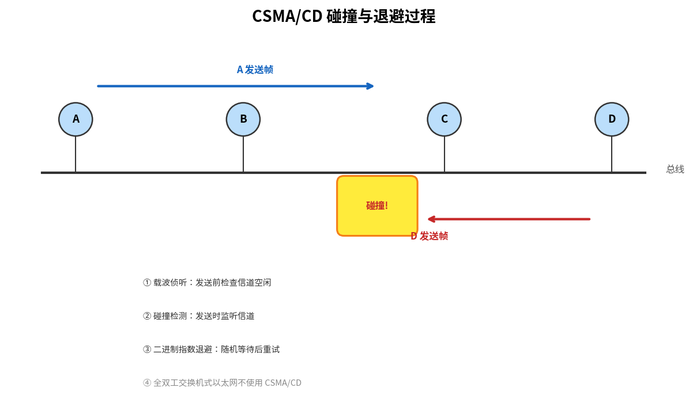

# 随机访问协议

> 参考：Kurose §6.3.2

随机访问协议（random access protocols）中，发送节点始终以信道的**全速率 R bps** 传输。发生碰撞时，各碰撞节点**随机等待**一段独立时间后重传，而非立即重传。由于随机延迟独立选取，有可能某个节点选出最短延迟从而成功"插入"信道。

## 时隙 ALOHA（Slotted ALOHA）

时隙 ALOHA 是最简单的随机访问协议之一，前提假设：

- 所有帧恰好由 L 比特组成
- 时间划分成 $L/R$ 秒的时隙（一个时隙 = 传输一帧的时间）
- 节点**只在时隙起点**开始传输
- 节点同步，知道时隙何时开始
- 如果碰撞，所有节点在时隙结束前能检测到

**操作**：
1. 节点有新帧时，等待下一个时隙起点，在该时隙传输整帧
2. 无碰撞 → 成功，无需重传
3. 有碰撞 → 以概率 $p$ 在每个后续时隙中重传，直到成功

**效率分析**：设每个节点以概率 $p$ 在时隙中传输，N 个活动节点。一个给定时隙成功的概率为 $Np(1-p)^{N-1}$。取得最大效率时：

$$\max_{p} Np(1-p)^{N-1} = \frac{1}{e} \approx 0.37$$

因此时隙 ALOHA 的最大效率约为 **37%**。即信道有效吞吐量最多为 $0.37R$ bps，其中约 37% 的时隙是空时隙，26% 的时隙发生碰撞。

## 纯 ALOHA（Pure ALOHA）

纯 ALOHA 是**无时隙的、完全去中心化**的协议：
1. 帧到达后**立即**传输整帧
2. 若发生碰撞，以概率 $p$ 立即重传；否则等待一个帧传输时间后再以概率 $p$ 重传

**效率分析**：一帧在 $t_0$ 开始传输。为成功传输，$[t_0-1, t_0]$ 和 $[t_0, t_0+1]$ 两个区间内都不得有其他节点开始传输。最大效率为：

$$\frac{1}{2e} \approx 0.185$$

恰好是时隙 ALOHA 的一半——这就是完全去中心化的代价。

## CSMA（载波侦听多路访问）

ALOHA 的问题在于节点无视其他节点的活跃状态，像一个在鸡尾酒会上不管别人是否在说话就只管自己喋喋不休的人。CSMA 增加了两条重要的"礼貌"规则：

**载波侦听（Carrier Sensing）**：传输前先"听"——如果信道上有其他节点正在传输，就等待信道空闲后再开始传输。

**碰撞检测（Collision Detection）**：传输过程中"边听边发"——如果检测到其他节点也在传输（即发生碰撞），立即停止传输，等待随机时间后再重试。

这两个规则合称 **CSMA/CD**（CSMA with Collision Detection）。

### 为什么 CSMA 仍然会发生碰撞？

关键在于**信道传播时延（channel propagation delay）**。节点 B 在 $t_0$ 开始传输，其信号尚未到达节点 D，D 在 $t_1 > t_0$ 检测到信道空闲并开始传输——碰撞就发生了。传播时延越大，碰撞概率越高。

## CSMA/CD 的完整操作流程

1. 适配器从网络层获得数据报，准备链路层帧，放入适配器缓冲区
2. 检测到**信道空闲** → 开始传输帧；检测到**信道忙** → 等待直至空闲，然后开始传输
3. 传输过程中，持续监听信道中是否有其他适配器的信号能量
4. 若在整个帧传输过程中未检测到外来信号 → 完成；若检测到外来信号 → **中止传输**
5. 中止后等待**随机时间**，返回步骤 2

## 二进制指数退避（Binary Exponential Backoff）

碰撞后等待多长时间？二进制指数退避算法优雅地解决了这一问题。以太网和 DOCSIS 都采用此算法。

对于已经历 n 次碰撞的帧，节点从 $\{0, 1, 2, \ldots, 2^n-1\}$ 中均匀随机选择 K，实际等待时间为 $K \cdot 512$ 比特时间（以太网）。n 的上限为 10。

| 碰撞次数 n | K 的选择范围 |
|-----------|-------------|
| 1 | {0, 1} |
| 2 | {0, 1, 2, 3} |
| 3 | {0, 1, ..., 7} |
| ≥10 | {0, 1, ..., 1023} |

碰撞次数越多，等待时间的集合越大——选择范围**指数增长**，因此得名"二进制指数退避"。每次准备新帧时，算法重置，不考虑之前的碰撞历史。

## CSMA/CD 效率

CSMA/CD 效率定义为大量活动节点长期传输中无碰撞帧所占的时间比例。其近似公式为：

$$\text{效率} = \frac{1}{1 + 5d_{prop}/d_{trans}}$$

其中 $d_{prop}$ 为任意两个适配器间的最大传播时延，$d_{trans}$ 为传输最大帧的时间。当 $d_{prop} \to 0$ 或 $d_{trans} \to \infty$ 时，效率趋近于 1。

- [[多路访问协议]]
- [[信道划分协议]]
- [[轮流协议与DOCSIS]]
- [[以太网]]
